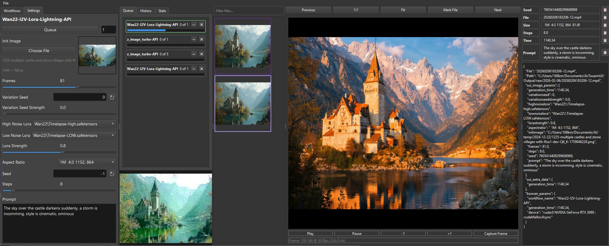

# bowser-gen

A Qt-based graphical user interface for ComfyUI, designed to provide an intuitive workflow management system for stable diffusion and other AI image generation tasks.

## Overview

`bowser-gen` is a PySide6 application that serves as a front-end for ComfyUI, allowing users to:
- Manage and organize workflows
- Queue multiple jobs for batch processing
- View and manage generated images and videos
- Track job progress and history
- Import/export workflow settings



## Features

### Workflow Management
- **Directory-based organization**: Browse workflows organized in directories
- **Lazy loading**: Efficient loading of workflows as directories are expanded
- **GUI node extraction**: Automatically detects and displays SwarmInput nodes for easy configuration

### Job Queueing
- Queue multiple instances of the same workflow
- Automatic seed generation for batch processing
- Progress tracking with visual indicators
- Job cancellation and reloading

### Image & Video Viewing
- Built-in image gallery for browsing generated outputs
- Image viewer with zoom and navigation controls
- Video playback support
- Metadata viewer for examining generation parameters

### Settings & Configuration
- Configurable ComfyUI server address
- Customizable output and workflow directories
- Dark mode interface
- Keyboard shortcuts for common actions

## Installation

### Prerequisites
- Install SwarmUI and verify it runs

### Dependencies

The application requires the following dependencies (automatically installed via `pyproject.toml`):

```
toml>=0.10.2
urllib3>=2.6.3
core  # Local package for shared functionality
PySide6  # Qt bindings for Python
opencv-python  # For video processing
Pillow  # For image handling
```

## Usage

### Running the Application

first start ComfyUI with the SwarmUI nodes and models, something like

```bash
.\SwarmUI\dlbackend\comfy\python_embeded\python.exe -s .\SwarmUI\dlbackend\comfy\ComfyUI\main.py --windows-standalone-build --extra-model-paths-config  .\SwarmUI\Data\comfy-auto-model.yaml --disable-auto-launch --preview-method latent2rgb
```

then run the application something like

```bash
# From the project root
gen

# With custom server address
gen --server 192.168.1.100:8188

# With custom workflows directory
gen --workflows /path/to/workflows
```

### Command Line Arguments

| Argument | Description | Default |
|----------|-------------|---------|
| `--server` | ComfyUI server address | `127.0.0.1:8188` |
| `--workflows` | Path to workflows directory | None |

### Keyboard Shortcuts

| Key | Action |
|-----|--------|
| **A** | Previous thumbnail |
| **D** | Next thumbnail |
| **R** | Fit image to window |
| **1** | Display image at 1:1 scale |
| **X** | Mark/unmark current file |
| **Ctrl+D** | Delete marked files |
| **Ctrl+Shift+H** | Clear history |

### Interface Overview

The main window is divided into several sections:

1. **Workflows Panel** (Left)
   - Browse workflows organized in directories
   - Click on JSON files to load workflows
   - Supports drag-and-drop of image files to import settings

2. **Queue Panel** (Center-left)
   - View queued and completed jobs
   - Monitor progress with visual indicators
   - Cancel or reload jobs
   - View system statistics and device information

3. **Image Gallery** (Center)
   - Thumbnail view of generated images
   - Click thumbnails to view full image

4. **Image/Video Viewer** (Right)
   - Display and navigate through generated outputs
   - Supports both images and videos
   - Navigation controls (Previous/Next/Mark)

5. **Metadata Viewer** (Far right)
   - Display generation parameters and metadata
   - Shows workflow settings, seed values, etc.

## Workflow Format

`bowser-gen` works with ComfyUI workflows in JSON format. It automatically detects and displays GUI nodes with the following types:

- **SwarmInputSlider**: Slider controls for numeric parameters
- **SwarmInputSeed**: Integer input for seed values with reset functionality
- **SwarmInputText**: Multi-line text input for prompts
- **SwarmInputDropdown**: Dropdown selection for options
- **SwarmInputImage**: Image file selection with thumbnail preview

### Metadata Storage

Generated images store metadata in PNG info chunks, including:
- Generation time
- Workflow name
- Device information
- All input parameter values
- Seed values

This metadata can be imported by dragging images back onto the workflow settings panel.

## Configuration

Settings are stored in `bowser-gen.toml` in the application directory:

```toml
[settings]
server_address = "127.0.0.1:8188"
output_root = "/path/to/output"
workflow_root = "/path/to/workflows"
```

### Output Directory Structure

By default, outputs are organized by date:
```
output_root/
├── YYYY-MM-DD/
│   ├── YYYYMMDDHHmmss-XX.png
│   ├── YYYYMMDDHHmmss-XX.mp4
│   └── ...
```

Where `XX` is a counter to ensure unique filenames.

## Development

### Project Structure

```
apps/gen/
├── src/
│   └── gen/
│       ├── __init__.py
│       ├── main.py          # Entry point
│       ├── genmain.py       # Main application window
│       ├── workflowswidget.py # Workflow management
│       ├── queuewidget.py   # Job queue management
│       ├── comfyserver.py   # ComfyUI server communication
│       └── ...
├── pyproject.toml          # Build configuration
└── README.md               # This file
```

### Building

The package uses `uv_build` for building:

```bash
# Install build dependencies
pip install uv_build

# Build the package
uv build
```

### Running Tests

No formal test suite is currently included, but you can run the application directly:

```bash
python -m gen
```

## Architecture

### Main Components

1. **GenMain (genmain.py)**
   - Main application window
   - Manages menu bar and central layout
   - Coordinates between workflows, queue, and viewers

2. **WorkflowsWidget (workflowswidget.py)**
   - Displays workflow directory tree
   - Extracts and renders GUI nodes from workflow JSON
   - Handles workflow loading and settings management

3. **QueueWidget (queuewidget.py)**
   - Manages job queue and history
   - Communicates with ComfyUI server via WebSocket
   - Handles job execution, progress tracking, and results

4. **comfyServer (comfyserver.py)**
   - WebSocket client for ComfyUI
   - Handles prompt queuing, cancellation, and result retrieval
   - Provides system statistics and device information

### Communication Flow

1. User loads a workflow from the file system
2. GUI nodes are extracted and rendered
3. User configures parameters and queues jobs
4. Jobs are sent to ComfyUI via WebSocket
5. Progress updates are received and displayed
6. Results are saved to output directory
7. Thumbnails are added to gallery

## Integration with ComfyUI

`bowser-gen` communicates with ComfyUI through:

- **WebSocket**: Real-time progress updates and binary image previews
- **HTTP API**: Prompt queuing, result retrieval, and system statistics

### Supported ComfyUI Features

- Prompt queuing and execution
- Progress tracking
- Image and video result retrieval
- System statistics (RAM, VRAM, device info)
- Object information for dropdown options
- Image upload for input nodes

## Tips and Tricks

### Importing Settings from Images

Drag generated images onto the workflow settings panel to automatically import:
- Seed values
- Prompt text
- Slider values
- Model settings
- And other parameters

### Batch Processing

Use the queue count input to run the same workflow multiple times with different seeds.

### Organizing Workflows

Create subdirectories in your workflows directory to organize related workflows together.

### Viewing Metadata

Click on thumbnails in the gallery to view detailed metadata about each generation.

## Troubleshooting

### Common Issues

**WebSocket connection failed**
- Ensure ComfyUI is running
- Check the server address in settings
- Verify firewall settings allow WebSocket connections

**Workflows not loading**
- Ensure JSON files are in the correct directory
- Check file permissions
- Verify JSON files are valid

**Images not appearing in gallery**
- Check the output directory path in settings
- Ensure the directory exists and is writable
- Verify the application has permission to access the directory

**Job errors**
- Check the error message in the popup
- Verify all required parameters are set
- Ensure the ComfyUI server has the required models and extensions

## License

This project is licensed under the MIT License.

## Contributing

Contributions are welcome! Please feel free to submit a Pull Request.

## Support

For issues and questions, please open an issue on the GitHub repository.
